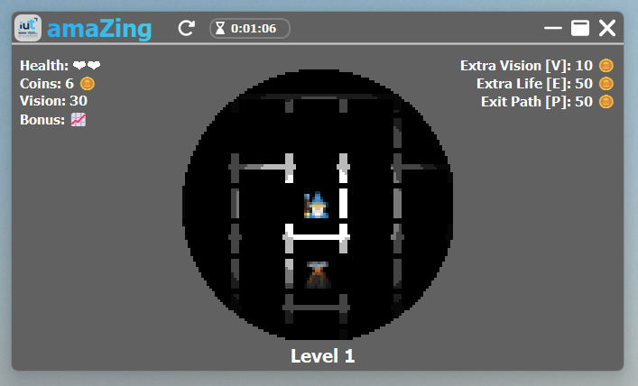

<div align="center">
    <a href="https://iut-info.univ-reims.fr/gitlab/bayf0001/amazeinpython"></a>
    <h2>Louis RATTANAVONG et Paul BAYFIELD</h2>
    <h1>amaZing</h1>
</div>

## Sommaire

- ### [Introduction](#1-introduction)
- ### [Installation](#2-installation)
- ### [Jeu](#3-jeu)
- ### [Credits](#4-credits)


# 1. Introduction 

**`amaZing`** est un `Rogue-Like`, un jeu sans fin ou le but est d'exploré un Labyrinthe !  
Créé par Louis RATTANAVONG et Paul BAYFIELD pour le Bonus de la SAE Labyrinthes, 2023.

```shell
# encoding:utf-8
#    _     __  __   _    _______   _                  _   _
#   /_\   |  \/  | /_\  |_  / __| (_)_ _    _ __ _  _| |_| |_  ___ _ _
#  / _ \  | |\/| |/ _ \  / /| _|  | | ' \  | '_ \ || |  _| ' \/ _ \ ' \
# /_/ \_\ |_|  |_/_/ \_\/___|___| |_|_||_| | .__/\_, |\__|_||_\___/_||_|
#                                          |_|   |__/
# sae@butinfo:~$
```



Excusez moi si le code n'est pas commenté, je n'ai pas eu beaucoup de temps :D


# 2. Installation

- [En utilisant `git`](#en-utilisant-git)
- [En utilisant l'executable, `exe`](#en-utilisant-le-exe)


## En utilisant Git

> Récupération du dépôt :
```shell
git clone https://gitlab.com/paul.bayfield/amazing
```

> Changement de répertoire :
```shell
cd amaZing
```

> Installation des 'requirements', librairies nécessaires au bon fonctionnement du jeu :
```shell
pip install -r requirements.txt
```
ou,
```shell
python -m pip install -r requirements.txt
```

> Lancez le jeu!
```shell
python main.py
```

## En utilisant le .exe

> Téléchargez le fichier `amaZing.exe` et lancez le !

> **C'est normal si le fichier est un peu volumineux, il contient tous les fichiers pour son bon fonctionnement...**

> Si vous ne faites pas confiance en mon `amaZing.exe` vous pouvez le recompiler vous-même, la configuration est dans : [auto-py-to-exe-config.json](./auto-py-to-exe-config.json).

# 3. Jeu

🧙‍♂️ • Gandalf - Vous  
🏕️ • La fin du Labyrinthe  
❤️ • De la vie  
🌋 • Un volcan, -1 de vie  
🪙 • Une pièce  
📈 • x2 multiplie le nombre de pièces collectés par deux  
⬛ • 'aveuglement', vous êtes aveugle pour les 5 prochaines cases  
🔦 • Lampe torche, votre vision est plus importante pour 10 secondes  
💰 • Un sac de pièces  


# 4. Credits

Pistes audios composées par [`xtrem-dm`](https://soundcloud.com/xtrem-dm) (#la Bulle)
